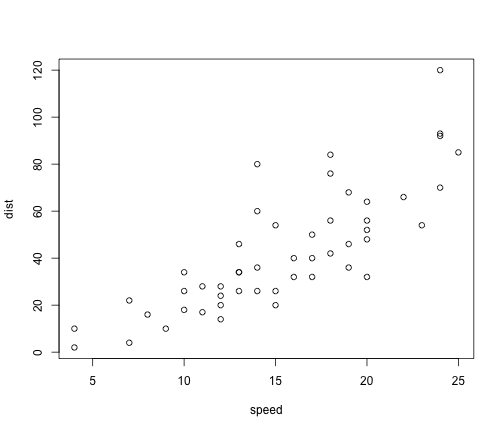

```r
library(knitr)
library(rmarkdown)
suppressPackageStartupMessages(library(googleVis))
```

```
## Creating a generic function for 'toJSON' from package 'jsonlite' in package 'googleVis'
```

```r
knitr::opts_chunk$set( message=FALSE, 
                       warning=FALSE)
```

## base
<http://www.statmethods.net/graphs/>

```r
plot(iris$Sepal.Length, iris$Petal.Length,        # x variable, y variable
     col = iris$Species,                          # colour by species
     pch = 16,                                    # type of point to use
     cex = 1,                                     # size of point to use
     xlab = "Sepal Length",                       # x axis label
     ylab = "Petal Length",                       # y axis label
     main = "Flower Characteristics in Iris")     # plot title

legend (x = 4.5, y = 7, legend = levels(iris$Species), col = c(1:3), pch = 16)
```



## ggplot2
<http://ggplot2.org/>

```r
library(ggplot2)
gg <- ggplot(iris) +
      geom_point(aes(x=Sepal.Length, y=Petal.Length, color = Species)) +
      labs(title = "Flower Characteristics in Iris", x = "Sepal Length", y = "Petal Length")
gg
```


## ggvis
<http://ggvis.rstudio.com/>

```r
#install.packages("ggvis", repos=c("http://rstudio.org/_packages", "http://cran.rstudio.com")) 
library(ggvis)
data(iris)

# hack for title from: http://stackoverflow.com/questions/25018598/add-a-plot-title-to-ggvis
add_title <- function(vis, ..., x_lab = "X units", title = "Plot Title") {
  add_axis(vis, "x", title = x_lab) %>% 
    add_axis("x", orient = "top", ticks = 0, title = title,
             properties = axis_props(
               axis = list(stroke = "white"),
               labels = list(fontSize = 0)
             ), ...)
}

p <- ggvis(iris, x = ~Sepal.Length, y = ~Petal.Length, fill = ~Species) %>% add_title(title = "Flower Characteristics in Iris", 
                                                                                      x_lab = "Sepal.Length")
layer_points(p)
```

<!--html_preserve--><div id="plot_id689925366-container" class="ggvis-output-container">
<div id="plot_id689925366" class="ggvis-output"></div>
<div class="plot-gear-icon">
<nav class="ggvis-control">
<a class="ggvis-dropdown-toggle" title="Controls" onclick="return false;"></a>
<ul class="ggvis-dropdown">
<li>
Renderer: 
<a id="plot_id689925366_renderer_svg" class="ggvis-renderer-button" onclick="return false;" data-plot-id="plot_id689925366" data-renderer="svg">SVG</a>
 | 
<a id="plot_id689925366_renderer_canvas" class="ggvis-renderer-button" onclick="return false;" data-plot-id="plot_id689925366" data-renderer="canvas">Canvas</a>
</li>
<li>
<a id="plot_id689925366_download" class="ggvis-download" data-plot-id="plot_id689925366">Download</a>
</li>
</ul>
</nav>
</div>
</div>
<script type="text/javascript">
var plot_id689925366_spec = {
  "data": [
    {
      "name": "iris0",
      "format": {
        "type": "csv",
        "parse": {
          "Sepal.Length": "number",
          "Petal.Length": "number"
        }
      },
      "values": "\"Sepal.Length\",\"Petal.Length\",\"Species\"\n5.1,1.4,\"setosa\"\n4.9,1.4,\"setosa\"\n4.7,1.3,\"setosa\"\n4.6,1.5,\"setosa\"\n5,1.4,\"setosa\"\n5.4,1.7,\"setosa\"\n4.6,1.4,\"setosa\"\n5,1.5,\"setosa\"\n4.4,1.4,\"setosa\"\n4.9,1.5,\"setosa\"\n5.4,1.5,\"setosa\"\n4.8,1.6,\"setosa\"\n4.8,1.4,\"setosa\"\n4.3,1.1,\"setosa\"\n5.8,1.2,\"setosa\"\n5.7,1.5,\"setosa\"\n5.4,1.3,\"setosa\"\n5.1,1.4,\"setosa\"\n5.7,1.7,\"setosa\"\n5.1,1.5,\"setosa\"\n5.4,1.7,\"setosa\"\n5.1,1.5,\"setosa\"\n4.6,1,\"setosa\"\n5.1,1.7,\"setosa\"\n4.8,1.9,\"setosa\"\n5,1.6,\"setosa\"\n5,1.6,\"setosa\"\n5.2,1.5,\"setosa\"\n5.2,1.4,\"setosa\"\n4.7,1.6,\"setosa\"\n4.8,1.6,\"setosa\"\n5.4,1.5,\"setosa\"\n5.2,1.5,\"setosa\"\n5.5,1.4,\"setosa\"\n4.9,1.5,\"setosa\"\n5,1.2,\"setosa\"\n5.5,1.3,\"setosa\"\n4.9,1.4,\"setosa\"\n4.4,1.3,\"setosa\"\n5.1,1.5,\"setosa\"\n5,1.3,\"setosa\"\n4.5,1.3,\"setosa\"\n4.4,1.3,\"setosa\"\n5,1.6,\"setosa\"\n5.1,1.9,\"setosa\"\n4.8,1.4,\"setosa\"\n5.1,1.6,\"setosa\"\n4.6,1.4,\"setosa\"\n5.3,1.5,\"setosa\"\n5,1.4,\"setosa\"\n7,4.7,\"versicolor\"\n6.4,4.5,\"versicolor\"\n6.9,4.9,\"versicolor\"\n5.5,4,\"versicolor\"\n6.5,4.6,\"versicolor\"\n5.7,4.5,\"versicolor\"\n6.3,4.7,\"versicolor\"\n4.9,3.3,\"versicolor\"\n6.6,4.6,\"versicolor\"\n5.2,3.9,\"versicolor\"\n5,3.5,\"versicolor\"\n5.9,4.2,\"versicolor\"\n6,4,\"versicolor\"\n6.1,4.7,\"versicolor\"\n5.6,3.6,\"versicolor\"\n6.7,4.4,\"versicolor\"\n5.6,4.5,\"versicolor\"\n5.8,4.1,\"versicolor\"\n6.2,4.5,\"versicolor\"\n5.6,3.9,\"versicolor\"\n5.9,4.8,\"versicolor\"\n6.1,4,\"versicolor\"\n6.3,4.9,\"versicolor\"\n6.1,4.7,\"versicolor\"\n6.4,4.3,\"versicolor\"\n6.6,4.4,\"versicolor\"\n6.8,4.8,\"versicolor\"\n6.7,5,\"versicolor\"\n6,4.5,\"versicolor\"\n5.7,3.5,\"versicolor\"\n5.5,3.8,\"versicolor\"\n5.5,3.7,\"versicolor\"\n5.8,3.9,\"versicolor\"\n6,5.1,\"versicolor\"\n5.4,4.5,\"versicolor\"\n6,4.5,\"versicolor\"\n6.7,4.7,\"versicolor\"\n6.3,4.4,\"versicolor\"\n5.6,4.1,\"versicolor\"\n5.5,4,\"versicolor\"\n5.5,4.4,\"versicolor\"\n6.1,4.6,\"versicolor\"\n5.8,4,\"versicolor\"\n5,3.3,\"versicolor\"\n5.6,4.2,\"versicolor\"\n5.7,4.2,\"versicolor\"\n5.7,4.2,\"versicolor\"\n6.2,4.3,\"versicolor\"\n5.1,3,\"versicolor\"\n5.7,4.1,\"versicolor\"\n6.3,6,\"virginica\"\n5.8,5.1,\"virginica\"\n7.1,5.9,\"virginica\"\n6.3,5.6,\"virginica\"\n6.5,5.8,\"virginica\"\n7.6,6.6,\"virginica\"\n4.9,4.5,\"virginica\"\n7.3,6.3,\"virginica\"\n6.7,5.8,\"virginica\"\n7.2,6.1,\"virginica\"\n6.5,5.1,\"virginica\"\n6.4,5.3,\"virginica\"\n6.8,5.5,\"virginica\"\n5.7,5,\"virginica\"\n5.8,5.1,\"virginica\"\n6.4,5.3,\"virginica\"\n6.5,5.5,\"virginica\"\n7.7,6.7,\"virginica\"\n7.7,6.9,\"virginica\"\n6,5,\"virginica\"\n6.9,5.7,\"virginica\"\n5.6,4.9,\"virginica\"\n7.7,6.7,\"virginica\"\n6.3,4.9,\"virginica\"\n6.7,5.7,\"virginica\"\n7.2,6,\"virginica\"\n6.2,4.8,\"virginica\"\n6.1,4.9,\"virginica\"\n6.4,5.6,\"virginica\"\n7.2,5.8,\"virginica\"\n7.4,6.1,\"virginica\"\n7.9,6.4,\"virginica\"\n6.4,5.6,\"virginica\"\n6.3,5.1,\"virginica\"\n6.1,5.6,\"virginica\"\n7.7,6.1,\"virginica\"\n6.3,5.6,\"virginica\"\n6.4,5.5,\"virginica\"\n6,4.8,\"virginica\"\n6.9,5.4,\"virginica\"\n6.7,5.6,\"virginica\"\n6.9,5.1,\"virginica\"\n5.8,5.1,\"virginica\"\n6.8,5.9,\"virginica\"\n6.7,5.7,\"virginica\"\n6.7,5.2,\"virginica\"\n6.3,5,\"virginica\"\n6.5,5.2,\"virginica\"\n6.2,5.4,\"virginica\"\n5.9,5.1,\"virginica\""
    },
    {
      "name": "scale/fill",
      "format": {
        "type": "csv",
        "parse": {}
      },
      "values": "\"domain\"\n\"setosa\"\n\"versicolor\"\n\"virginica\""
    },
    {
      "name": "scale/x",
      "format": {
        "type": "csv",
        "parse": {
          "domain": "number"
        }
      },
      "values": "\"domain\"\n4.12\n8.08"
    },
    {
      "name": "scale/y",
      "format": {
        "type": "csv",
        "parse": {
          "domain": "number"
        }
      },
      "values": "\"domain\"\n0.705\n7.195"
    }
  ],
  "scales": [
    {
      "name": "fill",
      "type": "ordinal",
      "domain": {
        "data": "scale/fill",
        "field": "data.domain"
      },
      "points": true,
      "sort": false,
      "range": "category10"
    },
    {
      "name": "x",
      "domain": {
        "data": "scale/x",
        "field": "data.domain"
      },
      "zero": false,
      "nice": false,
      "clamp": false,
      "range": "width"
    },
    {
      "name": "y",
      "domain": {
        "data": "scale/y",
        "field": "data.domain"
      },
      "zero": false,
      "nice": false,
      "clamp": false,
      "range": "height"
    }
  ],
  "marks": [
    {
      "type": "symbol",
      "properties": {
        "update": {
          "size": {
            "value": 50
          },
          "x": {
            "scale": "x",
            "field": "data.Sepal\\.Length"
          },
          "y": {
            "scale": "y",
            "field": "data.Petal\\.Length"
          },
          "fill": {
            "scale": "fill",
            "field": "data.Species"
          }
        },
        "ggvis": {
          "data": {
            "value": "iris0"
          }
        }
      },
      "from": {
        "data": "iris0"
      }
    }
  ],
  "legends": [
    {
      "orient": "right",
      "fill": "fill",
      "title": "Species"
    }
  ],
  "axes": [
    {
      "type": "x",
      "scale": "x",
      "orient": "bottom",
      "title": "Sepal.Length",
      "layer": "back",
      "grid": true
    },
    {
      "type": "x",
      "scale": "x",
      "orient": "top",
      "title": "Flower Characteristics in Iris",
      "ticks": 0,
      "layer": "back",
      "grid": true,
      "properties": {
        "labels": {
          "fontSize": {
            "value": 0
          }
        },
        "axis": {
          "stroke": {
            "value": "white"
          }
        }
      }
    },
    {
      "type": "y",
      "scale": "y",
      "orient": "left",
      "layer": "back",
      "grid": true,
      "title": "Petal.Length"
    }
  ],
  "padding": null,
  "ggvis_opts": {
    "keep_aspect": false,
    "resizable": true,
    "padding": {},
    "duration": 250,
    "renderer": "svg",
    "hover_duration": 0,
    "width": 504,
    "height": 504
  },
  "handlers": null
};
ggvis.getPlot("plot_id689925366").parseSpec(plot_id689925366_spec);
</script><!--/html_preserve-->

## googleVis
<https://github.com/mages/googleVis#googlevis>

```r
library(googleVis)
op <- options(gvis.plot.tag = "chart")
options(op)

iris2 = iris[, c("Sepal.Length", "Petal.Length")]
i <- sapply(iris2, is.factor)
iris2[i] <- lapply(iris2[i], as.character)
flower <- gvisScatterChart(iris2, options = list(title = "Flower Characteristics in Iris"))
# plot(flower)
print(flower, "chart")
```

<!-- ScatterChart generated in R 3.3.1 by googleVis 0.6.0 package -->
<!-- Thu Aug  4 10:20:46 2016 -->


<!-- jsHeader -->
<script type="text/javascript">
 
// jsData 
function gvisDataScatterChartIDbec70818b82 () {
var data = new google.visualization.DataTable();
var datajson =
[
 [
 5.1,
1.4 
],
[
 4.9,
1.4 
],
[
 4.7,
1.3 
],
[
 4.6,
1.5 
],
[
 5,
1.4 
],
[
 5.4,
1.7 
],
[
 4.6,
1.4 
],
[
 5,
1.5 
],
[
 4.4,
1.4 
],
[
 4.9,
1.5 
],
[
 5.4,
1.5 
],
[
 4.8,
1.6 
],
[
 4.8,
1.4 
],
[
 4.3,
1.1 
],
[
 5.8,
1.2 
],
[
 5.7,
1.5 
],
[
 5.4,
1.3 
],
[
 5.1,
1.4 
],
[
 5.7,
1.7 
],
[
 5.1,
1.5 
],
[
 5.4,
1.7 
],
[
 5.1,
1.5 
],
[
 4.6,
1 
],
[
 5.1,
1.7 
],
[
 4.8,
1.9 
],
[
 5,
1.6 
],
[
 5,
1.6 
],
[
 5.2,
1.5 
],
[
 5.2,
1.4 
],
[
 4.7,
1.6 
],
[
 4.8,
1.6 
],
[
 5.4,
1.5 
],
[
 5.2,
1.5 
],
[
 5.5,
1.4 
],
[
 4.9,
1.5 
],
[
 5,
1.2 
],
[
 5.5,
1.3 
],
[
 4.9,
1.4 
],
[
 4.4,
1.3 
],
[
 5.1,
1.5 
],
[
 5,
1.3 
],
[
 4.5,
1.3 
],
[
 4.4,
1.3 
],
[
 5,
1.6 
],
[
 5.1,
1.9 
],
[
 4.8,
1.4 
],
[
 5.1,
1.6 
],
[
 4.6,
1.4 
],
[
 5.3,
1.5 
],
[
 5,
1.4 
],
[
 7,
4.7 
],
[
 6.4,
4.5 
],
[
 6.9,
4.9 
],
[
 5.5,
4 
],
[
 6.5,
4.6 
],
[
 5.7,
4.5 
],
[
 6.3,
4.7 
],
[
 4.9,
3.3 
],
[
 6.6,
4.6 
],
[
 5.2,
3.9 
],
[
 5,
3.5 
],
[
 5.9,
4.2 
],
[
 6,
4 
],
[
 6.1,
4.7 
],
[
 5.6,
3.6 
],
[
 6.7,
4.4 
],
[
 5.6,
4.5 
],
[
 5.8,
4.1 
],
[
 6.2,
4.5 
],
[
 5.6,
3.9 
],
[
 5.9,
4.8 
],
[
 6.1,
4 
],
[
 6.3,
4.9 
],
[
 6.1,
4.7 
],
[
 6.4,
4.3 
],
[
 6.6,
4.4 
],
[
 6.8,
4.8 
],
[
 6.7,
5 
],
[
 6,
4.5 
],
[
 5.7,
3.5 
],
[
 5.5,
3.8 
],
[
 5.5,
3.7 
],
[
 5.8,
3.9 
],
[
 6,
5.1 
],
[
 5.4,
4.5 
],
[
 6,
4.5 
],
[
 6.7,
4.7 
],
[
 6.3,
4.4 
],
[
 5.6,
4.1 
],
[
 5.5,
4 
],
[
 5.5,
4.4 
],
[
 6.1,
4.6 
],
[
 5.8,
4 
],
[
 5,
3.3 
],
[
 5.6,
4.2 
],
[
 5.7,
4.2 
],
[
 5.7,
4.2 
],
[
 6.2,
4.3 
],
[
 5.1,
3 
],
[
 5.7,
4.1 
],
[
 6.3,
6 
],
[
 5.8,
5.1 
],
[
 7.1,
5.9 
],
[
 6.3,
5.6 
],
[
 6.5,
5.8 
],
[
 7.6,
6.6 
],
[
 4.9,
4.5 
],
[
 7.3,
6.3 
],
[
 6.7,
5.8 
],
[
 7.2,
6.1 
],
[
 6.5,
5.1 
],
[
 6.4,
5.3 
],
[
 6.8,
5.5 
],
[
 5.7,
5 
],
[
 5.8,
5.1 
],
[
 6.4,
5.3 
],
[
 6.5,
5.5 
],
[
 7.7,
6.7 
],
[
 7.7,
6.9 
],
[
 6,
5 
],
[
 6.9,
5.7 
],
[
 5.6,
4.9 
],
[
 7.7,
6.7 
],
[
 6.3,
4.9 
],
[
 6.7,
5.7 
],
[
 7.2,
6 
],
[
 6.2,
4.8 
],
[
 6.1,
4.9 
],
[
 6.4,
5.6 
],
[
 7.2,
5.8 
],
[
 7.4,
6.1 
],
[
 7.9,
6.4 
],
[
 6.4,
5.6 
],
[
 6.3,
5.1 
],
[
 6.1,
5.6 
],
[
 7.7,
6.1 
],
[
 6.3,
5.6 
],
[
 6.4,
5.5 
],
[
 6,
4.8 
],
[
 6.9,
5.4 
],
[
 6.7,
5.6 
],
[
 6.9,
5.1 
],
[
 5.8,
5.1 
],
[
 6.8,
5.9 
],
[
 6.7,
5.7 
],
[
 6.7,
5.2 
],
[
 6.3,
5 
],
[
 6.5,
5.2 
],
[
 6.2,
5.4 
],
[
 5.9,
5.1 
] 
];
data.addColumn('number','Sepal.Length');
data.addColumn('number','Petal.Length');
data.addRows(datajson);
return(data);
}
 
// jsDrawChart
function drawChartScatterChartIDbec70818b82() {
var data = gvisDataScatterChartIDbec70818b82();
var options = {};
options["allowHtml"] = [true];
options["title"] = ["Flower Characteristics in Iris"];

    var chart = new google.visualization.ScatterChart(
    document.getElementById('ScatterChartIDbec70818b82')
    );
    chart.draw(data,options);
    

}
  
 
// jsDisplayChart
(function() {
var pkgs = window.__gvisPackages = window.__gvisPackages || [];
var callbacks = window.__gvisCallbacks = window.__gvisCallbacks || [];
var chartid = "corechart";
  
// Manually see if chartid is in pkgs (not all browsers support Array.indexOf)
var i, newPackage = true;
for (i = 0; newPackage && i < pkgs.length; i++) {
if (pkgs[i] === chartid)
newPackage = false;
}
if (newPackage)
  pkgs.push(chartid);
  
// Add the drawChart function to the global list of callbacks
callbacks.push(drawChartScatterChartIDbec70818b82);
})();
function displayChartScatterChartIDbec70818b82() {
  var pkgs = window.__gvisPackages = window.__gvisPackages || [];
  var callbacks = window.__gvisCallbacks = window.__gvisCallbacks || [];
  window.clearTimeout(window.__gvisLoad);
  // The timeout is set to 100 because otherwise the container div we are
  // targeting might not be part of the document yet
  window.__gvisLoad = setTimeout(function() {
  var pkgCount = pkgs.length;
  google.load("visualization", "1", { packages:pkgs, callback: function() {
  if (pkgCount != pkgs.length) {
  // Race condition where another setTimeout call snuck in after us; if
  // that call added a package, we must not shift its callback
  return;
}
while (callbacks.length > 0)
callbacks.shift()();
} });
}, 100);
}
 
// jsFooter
</script>
 
<!-- jsChart -->  
<script type="text/javascript" src="https://www.google.com/jsapi?callback=displayChartScatterChartIDbec70818b82"></script>
 
<!-- divChart -->
  
<div id="ScatterChartIDbec70818b82" 
  style="width: 500; height: automatic;">
</div>

## rCharts
<http://rcharts.io/>

```r
library(rCharts)
names(iris) = gsub("\\.", "", names(iris))
rPlot(PetalLength ~ SepalLength , data = iris, color = 'Species', type = 'point')
```

```
## Error in myChart$copy(): could not find function "new"
```

## plotly
<https://plot.ly/r/>

```r
library(plotly)
data(iris)
plot_ly(iris, x = Sepal.Length, y = Petal.Length, color = Species, mode = "markers") %>% 
  layout(title = "Flower Characteristics in Iris")
```

```
## Error in html_screenshot(x): Please install the webshot package (if not on CRAN, try devtools::install_github("wch/webshot"))
```

## ggplotly
<https://plot.ly/ggplot2/>

```r
p <- ggplot(iris) +
      geom_point(aes(x=Sepal.Length, y=Petal.Length, color = Species)) +
      labs(title = "Flower Characteristics in Iris")

ggplotly(p)
```

```
## Error in html_screenshot(x): Please install the webshot package (if not on CRAN, try devtools::install_github("wch/webshot"))
```

